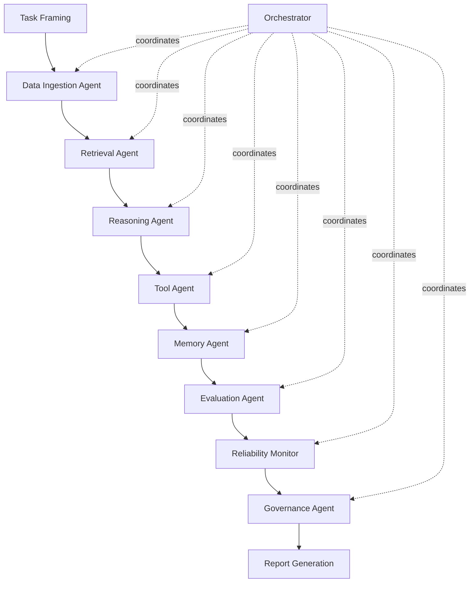

# Architecture Diagram

```mermaid
flowchart TD
    A[Task Framing] --> B[Data Ingestion Agent]
    B --> C[Retrieval Agent]
    C --> D[Reasoning Agent]
    D --> E[Tool Agent]
    E --> F[Memory Agent]
    F --> G[Evaluation Agent]
    G --> H[Reliability Monitor]
    H --> I[Governance Agent]
    I --> J[Report Generation]

    O[Orchestrator] -.coordinates.-> B
    O -.coordinates.-> C
    O -.coordinates.-> D
    O -.coordinates.-> E
    O -.coordinates.-> F
    O -.coordinates.-> G
    O -.coordinates.-> H
    O -.coordinates.-> I
```

## Reliability decomposition
- Retrieval accuracy: 30%
- Reasoning consistency: 35%
- Tool correctness: 25%
- Calibration complement (1 - ECE): 10%
